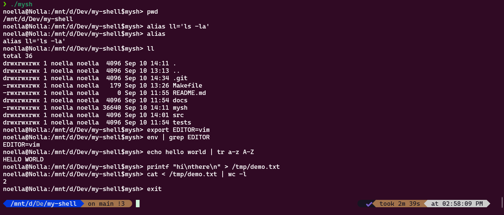

# Tiny Shell — mysh 🐚⚡
Custom Unix-like Shell with Built-ins, Aliases, Pipes, and Redirection

[](https://en.wikipedia.org/wiki/C_(programming_language))  
[](LICENSE)  
[](Makefile)  

---

✨ **Overview**  
This project implements a lightweight shell (`mysh`) in C.  
It started as an Operating Systems assignment and was extended into a practical developer tool.  

It demonstrates mastery of:  
- **Process control** (fork, execvp, wait)  
- **System calls** (I/O, file descriptors)  
- **User experience** (history, aliases, configs)  

🛠️ **Workflow**  
- Prompt: `user@host:cwd$mysh>` dynamic display  
- Loop: read → parse → execute → re-prompt  
- Built-ins: `cd`, `pwd`, `exit`, `export`, `alias`, `unalias`, `which`  
- Config: loads `~/.myshrc` (aliases, exports, etc.)  
- Environment: support for `export VAR=value`  
- History & editing: via GNU Readline (`↑ ↓`, `Ctrl+R`)  
- External commands: launched via `fork + execvp + wait`  
- Pipes & redirection: `|`, `<`, `>`, `>>` across multiple stages  
- Errors: descriptive messages (e.g., *No such directory*)  

**Author:** Noëlla Buti

---

## ✨ Overview
This project implements a lightweight shell (`mysh`) in C, designed as an academic OS assignment but extended into a practical developer tool.  

It supports core shell functionality (process control, built-ins) plus real-world features like aliasing, environment exports, pipelines, redirection, and `~/.myshrc` configuration.

The goal: demonstrate end-to-end mastery of process management, system calls, and user experience in a Unix environment.

---

## 🛠️ Workflow
- 📥 **Prompt**: dynamic `user@host:cwd$mysh>` display  
- 🔄 **Loop**: read → parse → execute → re-prompt  
- ⚙️ **Built-ins**: `cd`, `pwd`, `exit`, `export`, `alias`, `unalias`, `which`  
- 📝 **Configuration**: loads `~/.myshrc` on startup (aliases, exports, etc.)  
- 🧾 **Aliases**: shorthand commands with expansion  
- 🌱 **Environment**: `export VAR=value` integration  
- 📚 **History & Editing**: via GNU Readline (`↑ ↓`, `Ctrl-R`)  
- ➡️ **External Commands**: executed with `fork` + `execvp` + `wait`  
- 🔗 **Pipes & Redirection**: `|`, `<`, `>`, `>>` across multiple stages  
- 🛑 **Errors**: clear stderr messages (`Failed to create process`, `No such directory`, etc.)

---

## 🚦 Demo
Here’s a sample session showing off aliases, environment variables, pipes, and redirection:



---

## 📁 Repository Layout
```bash
src/ → main shell source (mysh.c)
docs/ → design notes, screenshots, demo assets
tests/ → sample scripts and test cases
Makefile → build rules (gcc + readline)
README.md → this overview
```
---

## 🔍 Features
- **Process Control**: fork/exec/wait with error handling  
- **Built-ins**: `cd`, `pwd`, `exit`, `export`, `alias`, `unalias`, `which`  
- **Configurable Startup**: executes `~/.myshrc`  
- **Aliases & Env Vars**: custom shortcuts + exports  
- **History & Editing**: persistent readline navigation  
- **Pipes & Redirection**: connect programs & manage I/O  

---

## 📜 License
MIT (see [LICENSE](LICENSE))

---


